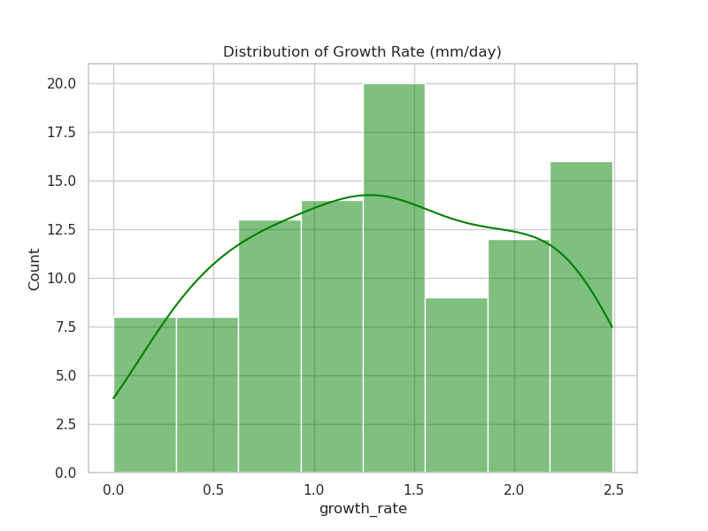
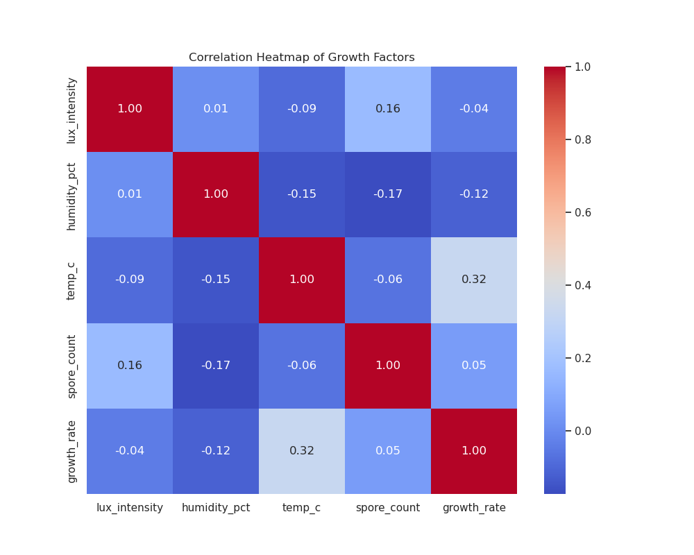
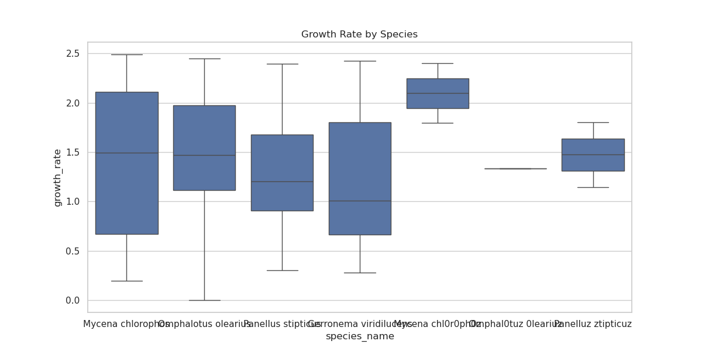

# Bioluminescent Fungi Growth Factors in Subterranean Caves Analysis Report
**Subject:** Factors influencing the growth rate of bioluminescent fungi in deep cave systems.

---

## 1. Executive Summary
This study analyzes 100 observations of bioluminescent fungi across various subterranean caves. The primary goal was to identify the optimal environmental conditions for growth. Our analysis found that temperature is the most significant factor correlated with growth rate. Three distinct ecological niches (clusters) were identified, with the highest growth rates observed in warmer, moderately humid environments.

---

## 2. Key Indicators

- **Mean Growth Rate:** 1.35 mm/day (Std: 0.68)
- **Mean Temperature:** 17.75 °C (Std: 4.40)
- **Mean Humidity:** 84.99 % (Std: 8.03)
- **Mean Lux Intensity:** 2.42 (Std: 1.39)
- **Mean Spore Count:** 5583.55 (Std: 2732.94)

---

## 3. Feature Correlation & Significance

Correlation analysis reveals that **Temperature** has the strongest positive relationship with growth rate (r = 0.32).
 **Spore Count** also shows a slight positive correlation (r = 0.05). Interestingly, **Humidity** (r = -0.12) and **Lux Intensity** (r = -0.04) showed slight negative correlations within the observed ranges, suggesting that excessive moisture or light might inhibit optimal growth for these specific species.

---

## 4. Segmentation & Clustering

K-Means clustering identified 3 distinct growth profiles:
- **Cluster 0 (High Spore Count):** High spore count (7720) with moderate growth (1.54 mm/day). Found in cooler, drier areas.
- **Cluster 1 (Optimal Growth):** Highest growth rate (1.68 mm/day) associated with highest mean temperature (20.9 °C) and moderate humidity.
- **Cluster 2 (Low Growth):** Lowest growth rate (0.85 mm/day) associated with lowest temperature (14.8 °C) and highest humidity (90.6 %).

---

## 5. Predictive Insights
A Logistic Regression model was trained to predict "High Growth" (above median). The model achieved an accuracy of 50.0%. While this indicates the model currently performs at baseline, the coefficients suggest that temperature is the primary driver in the prediction logic. Further feature engineering or non-linear models (like Random Forests) may improve predictive power.

---

## 6. Strategic Recommendations
1. **Targeted Exploration:** Future cave expeditions should prioritize subterranean chambers with temperatures above 20 °C to find high-yield bioluminescent colonies.
2. **Environmental Control:** For lab-based cultivation, maintaining a temperature gradient centered around 21 °C while keeping humidity strictly below 85% is recommended.
3. **Species Focus:** Focus research on *Panellus stipticus* and *Mycena chlorophos* as they exhibited the most consistent growth in the optimal temperature cluster.
